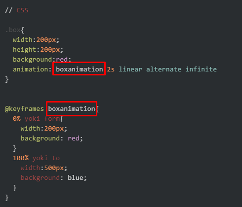
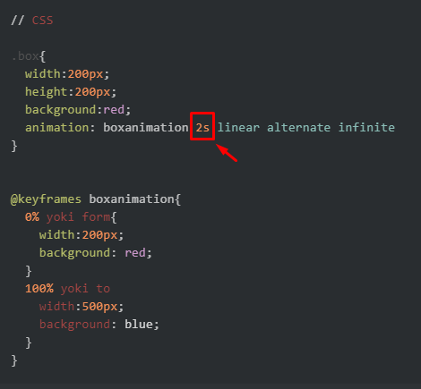
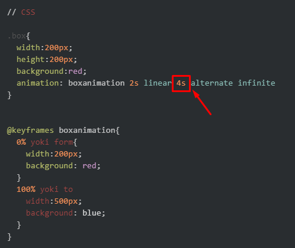
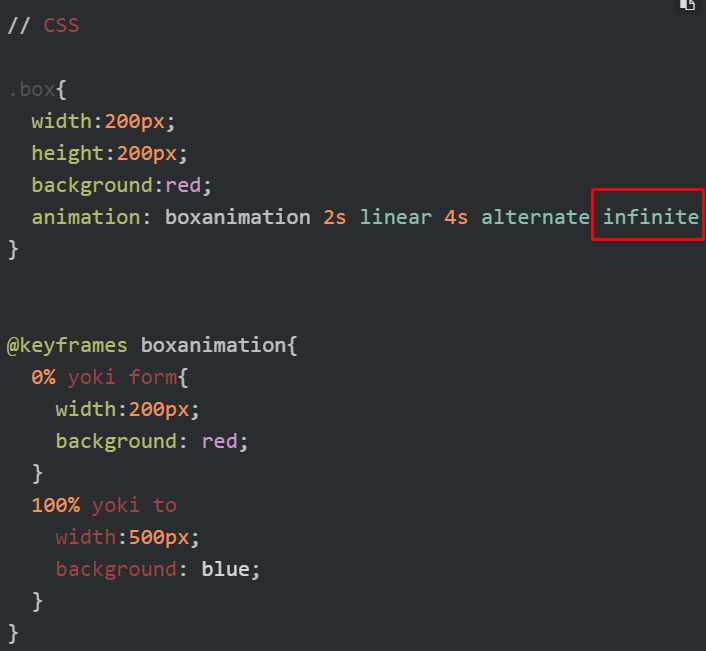

# Animations

# CSS Animtaions
## Dars rejasi:
- CSS Animations ozi nima?
- @keyframes
- Animtaion delay, duration, name, interation count 

## CSS Animation
💡**CSS Animation** - bu elementimizni **bir** styledan boshqa **bir** stylega holatga qarab (**tez yoki asta**) o'zgartirish uchun ishlatiladi. Animation bizga elementlarimizni **hohlagan marta,** hohlagancha o'zgartishga yordam beradi.

CSSda Animation **yaratish** uchun ishlatiladigan CSS **qoida** va **xossalari**:
- **@keyframes**
- **animation-name**
- **animation-duration**
- **animation-delay**
- **animation-iteration-count**
****
- *animation-direction*
- *animation-timing-function*
- *animation-fill-mode*
- *animation-play-state*
- *animation*

[CSS Animationsga misollar](https://freefrontend.com/css-animation-examples/)

### @keyframes
💡**@keyframes** - animatsiya stillarini qaysi vaqtda, qaysi korinishda va qaysi qiymatda o'zgarishini belgilab beradi.

Umumiy ko'rinishi:

```CSS
@keyframes animationName{
  % yoki "from"{
    width:100px;
  }
  % yoki "to"{
    width:300px;
  }
}
 ```
 
 ✅Animatsiyamizga **xoxlagan nomimizni** berishimiz mumkin. Keyframe intervallari uchun **0%** *dan* **100%** *gacha* bo'lgan qiymatlarni ishlatishimiz mumkin. va **0%** o'rniga ***from***, **100%** o'rniga esa ***to*** *kalit* so'zlarini ishlatishimiz mumkin.
 
 
 Masalan:
 
 ```HTML
// HTML

<div class="box">animation</div>
```
```CSS
// CSS

.box{
  width:200px;
  height:200px;
  background:red;
  animation: boxanimation 2s linear 4s alternate infinite
}


@keyframes boxanimation{
  0% yoki form{
    width:200px;
    background: red;
  }
  100% yoki to
    width:500px;
    background: blue;
  }
}
```

### Xossalar

💡**animation-name** : bu elementimiz ega bo'lgan animatsiya nomi.
```CSS
✔ .box{
    animation-name: bironta-nom
  }
```


<br><br>
<br>

****
<br>
<br>

💡**animation-duration** : animatsya qancha davom etishi uchun beriladigan qiymat. Uni biz **soniya (s)** yoki **milisoniyada (ms)** bersak bo'ladi
```CSS
✔ .box{
    animation-duration: 2s
  }
```

<br><br>
<br>
****
<br><br>
💡**animation-delay** : animatsiyamiz boshlanishidan oldin qancha **kechikishini** aytib o'tsak boladi. Uni biz **soniya (s)** yoki **milisoniyada (ms)** bersak bo'ladi
```CSS
✔ .box{
    animation-delay: 10s;
  }
```



💡**animation-iteration-count** : animatsiyamiz necha marta **takrorlanishini** belgilaydigan xossa. Unga qiymat bermasak agar **1** marta animatsiya takrorlanadi.

✅Agar animatsiyamiz **cheksiz** (infinite) bolishi kerak bo'lsa unda **son** o'rniga **infinite** deb yoziladi.
